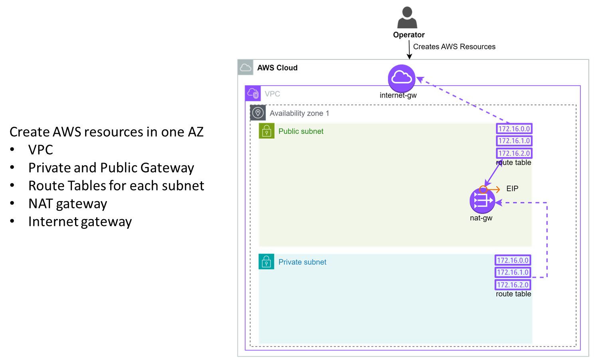
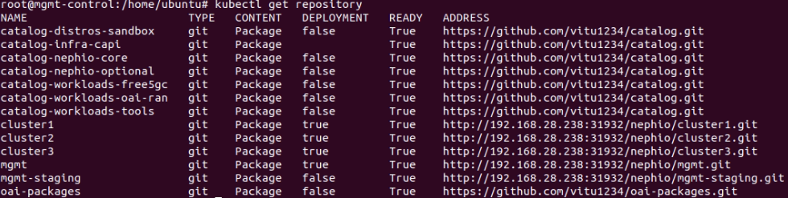
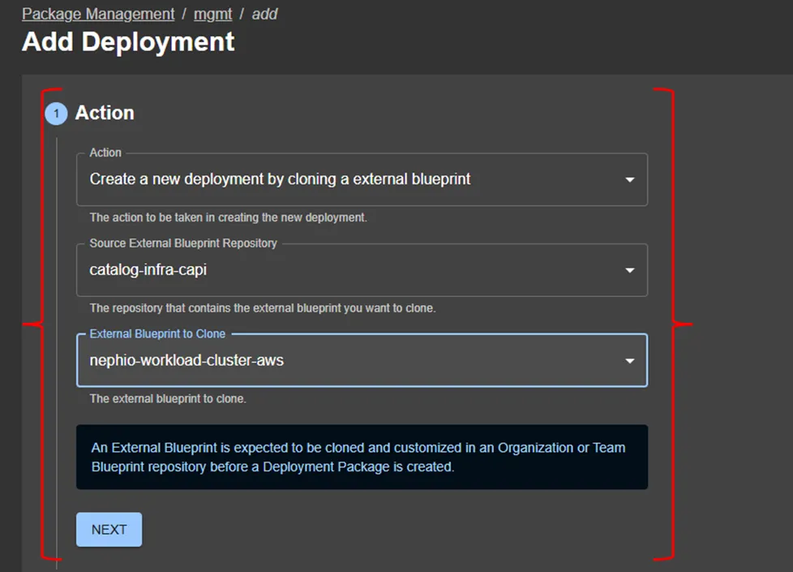

# AWS Nephio Bootstrapping, 5G Workload cluster Guide

### **SETTING UP ANSIBLE, AWS CLI, OTHER VARIABLES**

- Instructions to setup ansible, AWS CLI and other python variable [HERE](docs/pre-setup.md)
- To follow pictorial step by step guide, check [HERE](docs/picture-step-by-step.md)
- All commands used are in this guide
- Management cluster booststrapping [HERE](#bootstrap-management-cluster)
- Workload Cluster creation [HERE](#create-workload-clusters)
- OAI 5G cluster deployment [HERE](docs/oai-5g-deployment.md)

### **IMPORTANT NOTES**

- This guide is for creating 5G kubernetes clusters - self managed on AWS
- Currently tested on 1 region, 1 VPC and Same AZ with multiple subnets
- The catalog used in this demo ([HERE](https://github.com/vitu1234/catalog)) is shared across multiple cluster providers. Some fields, such as the `mode` in the Multus `NetworkAttachmentDefinition` custom resource, are set to `L3` by default. However, on AWS, an `L2` configuration is recommended. You can modify the package before deployment, or apply the fix demonstrated in the video tutorial.
- OAI packages used are on this repo ([HERE](https://github.com/vitu1234/oai-packages))
- The oai packages used are modified to suite the proposed target topology
- All the network functions fields have been prepopulated with configurations matching the test environment
- All AWS resources are pre-created during management cluster bootstrapping
- The management cluster is deployed in a public subnet to allow the Gitea server to be accessible from any cluster that requires it

### **RESULTS**

 **WHAT'S WORKING**

- Cluster creation and management via gitops on AWS
- Network function deployment and management via gitops
- All network functions can run and connect to each other

**WHAT'S NOT WORKING**

- UE unable to ping

### **STEPS OVERVIEW**

#### Installation 1 - AWS create resources from the bootstrap script

- VPC
- Private and Public subnets
- Route Tables for each subnet - one public and one private gateways are created
- NAT gateway
- Internet gateway
- To keep things simple and POC, the management cluster is in the public az and all workload clusters are in private az but the process is the same to achieve workload clusters in different az same region and VPC

  

#### Installation 2 – Create Management Cluster

- Set Variables from AWS, setup credentials for AWS and run the ansible playbooks to create a cluster on the public subnet.
- Ansible will automate creation of 3 AWS EC2 instances, install Kubernetes, setup and configure all nephio components to make this the management cluster

  

#### Installation 3 – Provision Workload Clusters

- SSH to the control node of the management cluster or access the Nephio WebUI to create Workload clusters
- Either PorchCtl or the WebUI can create the clusters
- After workload clusters are provisioned, it is important to install a CNI
- After Provisioning, the workload clusters connect to their respective git repo on management cluster git server
- ArgoCD is installed on each cluster to watch and pull from their respective repo resources

  

#### Installation 4 – Configure Workload Cluster’s CNI

- Cilium CNI is manually installed on the workload clusters to achieve multi-cluster connectivity
- If multi-cluster connectivity is not a priority, AWS VPC CNI, flannel or calico CNIs are readily available as KPT packages to be automatically installed via Nephio

  

### **BOOTSTRAP MANAGEMENT CLUSTER**

**Requirements Management cluster**

- Linux Flavour: Ubuntu-22.04-jammy
- AWS flavor depends on region selected. If `ap-southeast-1` region, you can use this AMI: `ami-0c1907b6d738188e5`
- Minimum 4 cores
- 8 GB memory
- 100 GB disk size
- AWS CLI already setup on the Local Server to run the bootstrapping process. Check guide [HERE](docs/pre-setup.md) or official docs [HERE](https://docs.aws.amazon.com/cli/latest/userguide/getting-started-quickstart.html)
- Install clusterawsadm and AWS CLI on the Local Server. Check official guide [HERE](https://cluster-api-aws.sigs.k8s.io/getting-started)

**Command line step by step guide**

  Clone, rename and move the folder into nephio

```bash
  git clone https://github.com/vitu1234/nephio-test-infra-aws.git
```

  Go the e2e/provision and run the following command

```bash
  pip install -r requirements.txt
```

  Since ansible is installed to another location, add it to path

```bash
  export PATH="$PATH:/home/ubuntu/.local/bin"
  source ~/.bashrc   # or ~/.bash_profile or ~/.profile based on your configuration

```

  Run the following Galaxy commands

```bash
  ansible-galaxy collection install ansible.posix
  ansible-galaxy collection install amazon.aws
```

  In the same folder e2e/provision run the following command

```bash
  ansible-galaxy install -r galaxy-requirements.yml
```

  **In AWS, create and download security key pair. Get the region name, keypair and preferrered AMI**

  Open */e2e/provision/playbooks/roles/ec2/vars/main.yml*  and put the variable names in *region_name, subnet_name, ami_id, vpc_id, keypair* and *instance_flavour.*

  Instance names/tags can also be changed in this file, I named mine control-demo, node1-demo, node2-demo

  Place the downloaded key pair in *e2e/provision/playbooks/nephio3.pem* in my case the keypair name in AWS is mynephio2025 and the file name is also mynephio2025. Change based on your naming

  Change the permission of the keypair

```bash
  chmod 400 playbooks/nephio3.pem
```

  The file *e2e/provision/install_sandbox.sh*  also contains the location of the keyfile above on private_key_file=~/nephio-test-infra-aws/e2e/provision/playbooks/nephio3.pem make sure it matches your naming and location

  Place AWS credentials in *e2e/provision/playbooks/setup.yml* in the following section for cloud formation

```yaml
  environment:
      AWS_REGION: ap-northeast-2
      AWS_ACCESS_KEY_ID: ""
      AWS_SECRET_ACCESS_KEY: ""
      AWS_SESSION_TOKEN: ""
```

  **Note:** The `AWS_SESSION_TOKEN` variable may be commented out depending on whether your AWS account has 2FA/MFA enabled. If 2FA/MFA is **not** enabled, you should comment out this variable.

  Like wise, place the credentials in *e2e/provision/playbooks/roles/capa/vars/main.yml* following section for CAPA

```yaml
  aws_region: "ap-northeast-2"
  aws_access_key: ""
  aws_secret_key: ""
  aws_session_token:
  cloud_formation_create: false 
```

> **Note:**
> The `aws_session_token` variable may be commented out depending on whether your AWS account has 2FA/MFA enabled.
> If 2FA/MFA is **not** enabled, you should comment out this variable.
>
> The `cloud_formation_create` variable must remain set to **false** if any of the other accounts already have the CAPA CloudFormation stack created.
> Set it to **true** only if the stack has **not** been created elsewhere.

  In the file `e2e/provision/playbooks/roles/ec2/vars/main.yml`, you must modify specific values to suit your AWS environment and 5G OAI deployment. This file defines variables for the AWS VPC setup, EC2 instance type, AMI selection, and subnets that map to the 5G OAI network topology.

  **Security Group and Region**

```yaml
  sg_name: default
  region_name: ap-southeast-1
```

  **AMI Selection**
  Choose the appropriate AMI for your region and operating system. The default is Ubuntu 22.04 LTS for the region i am using:

```yaml
  # ami_id: ami-09a7535106fbd42d5  # Ubuntu 22.04 LTS (alternative)
  ami_id: ami-0c1907b6d738188e5    # Ubuntu 22.04 LTS (default)
```

  **Key Pair and Instance Flavor**
  Define the EC2 SSH key pair and instance type to be used:

```yaml
  keypair: mynephio2025
  instance_flavour: t3.large
```

  **VPC and Primary Subnets**
  These settings configure the main network infrastructure:

```yaml
  vpc_name: nephio-5g
  vpc_cidr_block: 192.168.0.0/20
  subnet_cidr_block: 192.168.0.0/24              # Public instances subnet
  private_subnet_cidr_block: 192.168.1.0/24      # Primary private subnet
```

  **Additional Private Subnets**
  These are used to predefine the topology and assign specific functions to different zones:

```yaml
  private_subnets:
    - name: my_private_subnet1
      cidr: 192.168.9.0/24
    - name: my_private_subnet2
      cidr: 192.168.8.0/24
    - name: my_private_subnet3
      cidr: 192.168.10.0/24
    - name: my_private_subnet4
      cidr: 192.168.11.0/24
```

  **Network Interfaces (Aligned with 5G OAI Topology)**
  Each interface below is tied to a specific subnet and IP address. These IPs must match the expected addresses for each 5G component:

```yaml
  network_interfaces:
    - name: customeni-edge1
      ip: 192.168.9.203      # UPF_N4_IP
      subnet_name: my_private_subnet1
    - name: customeni-edge2
      ip: 192.168.8.16       # UPF_N6_IP
      subnet_name: my_private_subnet2
    - name: customeni-edge3
      ip: 192.168.10.50      # CUUP_F1U_GW
      subnet_name: my_private_subnet3
    - name: customeni-edge4
      ip: 192.168.11.60      # CUUP_E1_IP
      subnet_name: my_private_subnet4

    - name: customeni-core1
      ip: 192.168.8.53       # AMF_N2_IP
      subnet_name: my_private_subnet2
    - name: customeni-core2
      ip: 192.168.9.55       # SMF_N4_IP
      subnet_name: my_private_subnet1

    - name: customeni-regional1
      ip: 192.168.8.55       # CUCP_N2_IP
      subnet_name: my_private_subnet2
    - name: customeni-regional2
      ip: 192.168.11.20      # CUCP_E1_IP
      subnet_name: my_private_subnet4
    - name: customeni-regional3
      ip: 192.168.10.21      # CUCP_F1C_IP
      subnet_name: my_private_subnet3
```

> **Tips**

> - Make sure IP addresses and subnet CIDRs do not overlap.
> - Subnet names must match exactly with the names declared in the `private_subnets` section.
> - All network interface IPs should reflect your intended 5G deployment topology.

> Improper configuration here can cause instance creation to fail or result in unreachable network components.

---

  Finally, run the following command Vault password is *admin* but you can generate your own. The guide to setup ansible is shared in first steps. Please to it.

  In the same folder *e2e/provision/* run the following command:

```bash
  ./install_sandbox.sh
```

  Please NOTE CloudFormation can only exist in the current region where you want to install management cluster, If alread created in another region by another user, please follow the instrustions shared above and follow this guide on enabling multi-tenancy [HERE]{https://cluster-api-aws.sigs.k8s.io/topics/using-clusterawsadm-to-fulfill-prerequisites#cross-account-role-assumption}

  Bootstrapping takes for about 25-35mins depending on your internet speed

---

### **ACCESSING MANAGEMENT CLUSTER**

  To access the management cluster, ssh into the master instance on the public IP address and change to root user

  To access the nephio UI, run the following command in local computer and make sure the key file matches what you configured during bootstrapping

```bash
    ssh -i .\nephio3.pem ubuntu@<public-domain-name> -L 7007:localhost:7007 -L 3000:172.18.0.200:3000 sudo kubectl port-forward --namespace=nephio-webui svc/nephio-webui 7007
```

    The gitea server is on the public url which can be found by running the following command:

```bash
    kubectl get repository
```

  To access the management cluster, ssh into the master instance on the public IP address and change to root user

```bash
  ssh -i <path/to/keypair.pem> ubuntu@<public-domain-name-mgmt-control-node>
  sudo su
```

  To Verify that the management cluster is bootstrapped correctly, all pods should now be running in all namespaces and all repositories should be in *READY STATE (at this point, you won’t have cluster1, cluster2 and cluster3 repositories).*

  Run the following  command

```bash
  kubectl get pods -A
  kubectl get repositories
```

  

  To access the nephio web UI, run the following command in local computer in cmd and make sure the key file matches what you configured during bootstrapping.

```powershell
  ssh -i <path/to/keypair.pem> <username>@<public-domain-name-mgmt-control-node> -L 7007:localhost:7007 -L 3000:172.18.0.200:3000 sudo kubectl port-forward --namespace=nephio-webui svc/nephio-webui 7007
```

  Access the UI by going to

  [http://localhost:7007/](http://localhost:7007/)

  The gitea server is on the public url (so workload clusters can find it within the network or remotely) which can be found by running the following command:

```bash
  kubectl get repository | grep '^mgmt ' | awk '{print $6}' | sed 's/mgmt.git//'
```

  Credentials for the nephio nephio user: user: nephio password: secret

  To access ArgoCD web UI for the management cluster, use the following command in cmd

```bash
  ssh -i <path/to/keypair.pem> <username>@<public-domain-name-mgmt-control-node> -L 8080:localhost:443 sudo kubectl port-forward svc/argocd-server 443  
```

  Access the UI by going to:

  [https://localhost:8080/](https://localhost:8080/)

  Default username for ArgoCD UI is admin. Use the following command to obtain the default Argocd password to login

```bash
  kubectl -n argocd get secret argocd-initial-admin-secret -o jsonpath="{.data.password}" | base64 -d
```

### **CREATE WORKLOAD CLUSTERS**

- Access management cluster and get nephio-webui service

  
- The public IP and port will let you access the nephio-webui in the web browser

  - for example:

    ```powershell
    43.201.250.179:31953
    ```
- go to mgmt click deployment on and select the following values

  
- add the name of the cluster and oother metadata then click next on the other sections and click on CREATE DEPLOYMENT

  
- flannel is the default CNI as shown on 1, click on edit to remove it from the package on 2 because will install CILIUM CNI later

  
- Click on delete icon to delete flannel CNI on 1 and click on save on 2 as shown

  
- Click on Propose then Approve
- After for about 5mins, packages pending approval will show as below:
- ***If nothing shows up after refreshing the screen, run the following commands in the management cluster:

```powershell
  kubectl -n porch-system rollout restart deploy porch-server
  kubectl -n nephio-system rollout restart deploy nephio-controller
```

- The draft revisions will automatically show up after some 2-3mins like:

  
- In the mgmt-staging, if the packages are not automatically approved, just edit, propose and approve except for edge-argoapp (the first word depends on what you named the cluster)
- edge-argoapp requires an input of values

  
- Click on *edge-argoapp* edit then open StarlarkRun file and add the IP address and port for the git server.
- This is pretty much the IP and port number that you will see when you run this command in management cluster

```bash
  kubectl get repository -A
```

  

- Get that and put in the StarlarkRun on node_ip and http_port then click on save, propose and approve

  
- Similarly, go to the mgmt from the dashboard and approve edge-index Deployment except for *edge-repo* and *edge-cluster* which require values to be provided
- Starting with the *edge-repo*  edit the package and edge the StarlarkRun file to add in the node_ip and http_port just like how we did above for the *edge_argoapp* then Save, Propose and Approve
- Finally edit the edge-cluster where we have to add in our Workload-cluster AWS values/variables
- Edit the following files with all the values coming from AWS console

  

  then:

  
- In the AWSMachineTemplate files add the machine flavor, keypair for the CP and worker node. For the worker node, the recommendation is to use c5.4xlarge
- In the Cluster, add pod cidr and service cidr
- Add AMI cluster API image tag in the **AWSMachineTemplate** resource, i used ami-0a1cfa462ff5dc5d9 available in the ap-northeast-2 region
- Save, Propose and Approve
- After sometime the cluster will be created on AWS
- Repeat for all core and regional cluster and the clusters will be created
- After 2-5mins we have the instances created, up and running and each cluster will have its own git repo.
- Next, we have to get kubeconfig and install Cilium CNI otherwise if cluster interconnectivity is not required, no need to install a CNI as it will automatically be configured with Nephio through ArgoCD
- 

  

  

  

### **Inter-cluster networking - Optional**

  **load clusters**

  You will also need to configure the clusters with Cilium. Again, this will be automated in a future release.

```bash
   export CLUSTER1=core; export CLUSTER2=edge; export CLUSTER3=regional;
   cilium install --set cluster.name=$CLUSTER1 --set cluster.id=1 --context $CLUSTER1
   cilium install --set cluster.name=$CLUSTER2 --set cluster.id=2 --context $CLUSTER2
   cilium install --set cluster.name=$CLUSTER3 --set cluster.id=3 --context $CLUSTER3
   watch kubectl get pods -A --context core
   watch kubectl get pods -A --context edge
   watch kubectl get pods -A --context regional

   kubectl --context=$CLUSTER2 delete secret -n kube-system cilium-ca
   kubectl --context=$CLUSTER3 delete secret -n kube-system cilium-ca
   kubectl --context=$CLUSTER1 get secret -n kube-system cilium-ca -o yaml |   kubectl --context $CLUSTER2 create -f -
   kubectl --context=$CLUSTER1 get secret -n kube-system cilium-ca -o yaml |   kubectl --context $CLUSTER3 create -f -

   #ENABLED CLUSTERMESH
  cilium clustermesh enable --context $CLUSTER1 --service-type NodePort
  cilium clustermesh enable --context $CLUSTER2 --service-type NodePort
  cilium clustermesh enable --context $CLUSTER3 --service-type NodePort

   #CHECK THE STATUS
   cilium clustermesh status --context $CLUSTER1 --wait
   cilium clustermesh status --context $CLUSTER2 --wait
   cilium clustermesh status --context $CLUSTER3 --wait

   #INTER-CONNECT THE CLUSTERS
   cilium clustermesh connect --context $CLUSTER1 --destination-context $CLUSTER2
   cilium clustermesh connect --context $CLUSTER1 --destination-context $CLUSTER3
   cilium clustermesh connect --context $CLUSTER2 --destination-context $CLUSTER3

   #CHECK THE STATUS
   cilium clustermesh status --context $CLUSTER1 --wait
   cilium clustermesh status --context $CLUSTER2 --wait
   cilium clustermesh status --context $CLUSTER3 --wait

   #RUN CONNECTIVITY TEST - OPTIONAL
   cilium connectivity test --context $CLUSTER1 --multi-cluster $CLUSTER2
   cilium connectivity test --context $CLUSTER2 --multi-cluster $CLUSTER3
   cilium connectivity test --context $CLUSTER1 --multi-cluster $CLUSTER3

```

  **Network Bandwidth Test Between 2 Pods Different Clusters: Cluster A Pod A → Cluster B Pod B**

```yaml
  apiVersion: v1
  kind: Pod
  metadata:
    name: iperf-server
  spec:
    containers:
      - name: iperf
        image: cagedata/iperf3
        command: ["iperf3", "-s"]
        ports:
          - containerPort: 5201
```

```yaml
  apiVersion: v1
  kind: Pod
  metadata:
    name: iperf-client
  spec:
    containers:
      - name: iperf
        image: cagedata/iperf3
        command: ["sleep", "30000"]
```

```bash
  kubectl apply -f iperf.yaml --context core
  kubectl apply -f iperf-client.yaml --context edge
```

  **Run the iperf Test**
  Once both pods are running, you can run the iperf test. First, get the IP address of the iperf server pod:

```bash
  kubectl get pod iperf-server -o wide --context core
```

  Look for the `IP` column in the output. Suppose the IP address is `10.1.1.1`.

  Now, execute the iperf test from the client pod by running the following command:

```bash
  kubectl exec -it iperf-client --context edge  -- iperf3 -c <IP>
```

  **Run the iperf3 Client with Interval Reporting**
  Execute the iperf3 test from the client pod with the -i option to specify the interval for reporting throughput. For example, to report every 5 seconds:

```powershell
  kubectl exec -it iperf-client -- iperf3 -c <server-ip> -i 5
```

