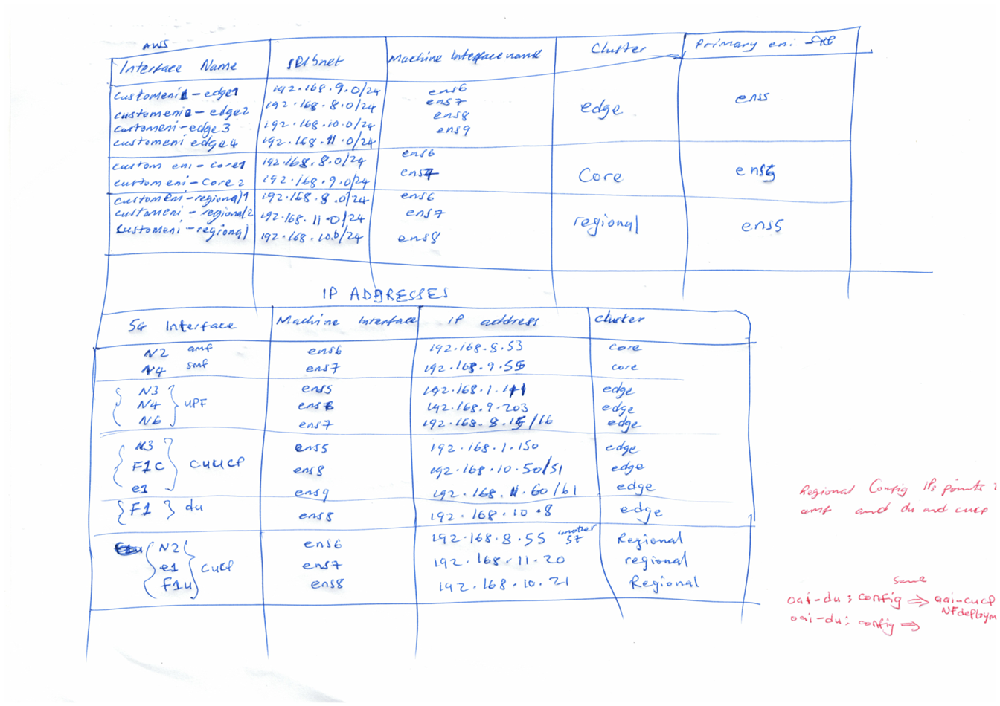

# AWS Nephio Boostrapping, 5G Workload cluster Guide

## OVERVIEW STEPS

### **BOOTSTRAP MANAGEMENT CLUSTER**

**Requirements Management cluster**

- Linux Flavour: Ubuntu-22.04-jammy
- Minimum 4 cores
- 8 GB memory
- 100 GB disk size
- Manually create VPC with 2 availability zones each having one subnet. For simplicity, one az is enough
- Install clusterawsadm and AWS CLI on the local machine
- Configure AWS CLI: [https://docs.aws.amazon.com/cli/latest/userguide/getting-started-quickstart.html](https://docs.aws.amazon.com/cli/latest/userguide/getting-started-quickstart.html)

### **INSTALLATION - PREPARE ENVIRONMENT**

- **Create AWS resources manually**

  - VPC
  - Private and Public Gateway
  - Route Tables for each subnet
  - NAT gateway
  - Internet gateway
  - To keep things simple and POC, the management cluster is in the public az and all workload clusters are in private az but the process is the same to achieve workload clusters in different az same region and VPC

  

  ### Installation 2 – Create Management Cluster


  - Set Variables from AWS, setup credentials for AWS and run the ansible playbooks to create a cluster on the public subnet.
  - Ansible will automate creation of 3 AWS EC2 instances, install Kubernetes, setup and configure all nephio components to make this the management cluster

  

  ### Installation 3 – Provision Workload Clusters

  - SSH to the control node of the management cluster or access the Nephio WebUI to create Workload clusters
  - Either PorchCtl or the WebUI can create the clusters
  - After workload clusters are provisioned, it is important to install a CNI
  - After Provisioning, the workload clusters connect to their respective git repo on management cluster git server
  - ArgoCD is installed on each cluster to watch and pull from their respective repo resources

  

  ### Installation 4 – Configure Workload Cluster’s CNI

  - Cilium CNI is manually installed on the workload clusters to achieve multi-cluster connectivity
  - If multi-cluster connectivity is not a priority, AWS VPC CNI, flannel or calico CNIs are readily available as KPT packages to be automatically installed via Nephio

  

### **STEP BY STEP PICTURE VIEW GUIDE**

#### Step 1

- Create and Configure AWS Resources

  

- After creating you should have something like this

  

  

- Edit subnet settings to allow auto-assign public ipv4 address to instances

  

- create you key-pair in EC2 menu

  

#### Step 2

- Configure Ansible Playbooks with Values from the created AWS resources
  - Variables to create management cluster Instances:

  

- - Auth Variables for Ansible to create AWS EC2 Instances:

  

  - Auth Variables for cloud formation and Cluster API:

    
- Auth Variables expire after 12hours, can be updated later!

#### Step 3

- Run the Ansible Playbook program from the local computer

  

- Takes 10-15mins bootstrapping the management cluster.
- Will create 1 Control node and 2 worker nodes

  

#### Step 4

- Accessing the Management Cluster Via SSH
  - Management cluster nodes

  

- SSH into the control node to access nephio components and create workload clusters

#### Step 5

- Check all the pods and repositories running in the management cluster

  

- Stock  and management repositories

  

#### Step 6

- Accessing the Management Cluster Via webui

  

  

#### Step 7

- Accessing the Nephio Via webui

1. Shows all registered repository, containing Infra resources for deployment
2. Contains core packages for respective clusters in deployment
3. All registered repositories from upstream provider

  

#### Step 8

- Creating workload clusters (core, regional and edge)

1. Clone the git repo with packagevariants already created to create 3 clusters with one command and apply resources

  

1. 3 drafts revisions for each cluster created

  

1. If multi-cluster connectivity is a priority, delete the flannel PackageVariant from each clusters’ revision

  

#### Step 9

- Creating workload clusters (core, regional and edge)

  

  

  Some infra and core packages in drafts in both mgmt and mgmt-staging respectively requires manual editing to add AWS variables and add git server URL and port

  

#### Step 10

- After 2-5mins we have the instances created, up and running and each cluster will have its own git repo.

  

- Next, we have to get kubeconfig and install Cilium CNI otherwise if cluster interconnectivity is not required, no need to install a CNI as it will automatically be configured with Nephio through ArgoCD

  

  

#### Step 11

- Installing cilium CNI on the workload clusters (core, regional and edge)

  

- install Cilium CNI otherwise if cluster interconnectivity is not required, no need to install a CNI as it will automatically be configured with Nephio through ArgoCD

  

- After installing Cilium, we have to interconnect the clusters using the ciliumctl

#### Step 12

- Installing cilium CNI on the workload clusters (core, regional and edge)
- Edge and core clusters interconnected:

  

- install Cilium CNI otherwise if cluster interconnectivity is not required, no need to install a CNI as it will automatically be configured with Nephio through ArgoCD
- After installing Cilium, we have to interconnect the clusters using the ciliumctl

#### Step 13

- Installing cilium CNI on the workload clusters (core, regional and edge)

  

  Regional, Edge and core clusters interconnected and passed the cilium interconnectivity test:

  

- install Cilium CNI otherwise if cluster interconnectivity is not required, no need to install a CNI as it will automatically be configured with Nephio through ArgoCD
- After installing Cilium, we have to interconnect the clusters using the ciliumctl

#### Step 14

- Iperf Test – testing pod-pod communication between clusters
- Iperf test conducted between edge and core cluster run successfully

  

### **ACCESSING MANAGEMENT CLUSTER**

  To access the management cluster, ssh into the master instance on the public IP address and change to root user

```bash
  ssh -i <path/to/keypair.pem> ubuntu@<public-domain-name-mgmt-control-node>
  sudo su
```

  To Verify that the management cluster is bootstrapped correctly, all pods should now be running in all namespaces and all repositories should be in *READY STATE (at this point, you won’t have cluster1, cluster2 and cluster3 repositories).*

  Run the following  command

```bash
  kubectl get pods -A
  kubectl get repositories
```

  

  To access the nephio web UI, run the following command in local computer in cmd and make sure the key file matches what you configured during bootstrapping.

```powershell
  ssh -i <path/to/keypair.pem> [ubuntu@](mailto:ubuntu@ec2-43-201-59-147.ap-northeast-2.compute.amazonaws.com)<public-domain-name-mgmt-control-node> -L 7007:localhost:7007 -L 3000:172.18.0.200:3000 sudo kubectl port-forward --namespace=nephio-webui svc/nephio-webui 7007
```

  Access the UI by going to

  [http://localhost:7007/](http://localhost:7007/)

  The gitea server is on the public url (so workload clusters can find it within the network or remotely) which can be found by running the following command:

```bash
  kubectl get repository | grep '^mgmt ' | awk '{print $6}' | sed 's/mgmt.git//'
```

  Credentials for the nephio nephio user: user: nephio password: secret

  To access ArgoCD web UI for the management cluster, use the following command in cmd

```bash
  ssh -i <path/to/keypair.pem> [ubuntu@](mailto:ubuntu@3.35.217.27)<public-domain-name-mgmt-control-node> -L 8080:localhost:443 sudo kubectl port-forward svc/argocd-server 443  
```

  Access the UI by going to:

  [https://localhost:8080/](https://localhost:8080/)

  Default username for ArgoCD UI is admin. Use the following command to obtain the default Argocd password to login

```bash
  kubectl -n argocd get secret argocd-initial-admin-secret -o jsonpath="{.data.password}" | base64 -d
```

### **CREATE WORKLOAD CLUSTERS**

- Access management cluster and get nephio-webui service

  

- The public IP and port will let you access the nephio-webui in the web browser

  - for example:

    ```powershell
    43.201.250.179:31953
    ```
- go to mgmt click deployment on and select the following values

  

- add the name of the cluster and oother metadata then click next on the other sections and click on CREATE DEPLOYMENT

  

- flannel is the default CNI as shown on 1, click on edit to remove it from the package on 2 because will install CILIUM CNI later

  

- Click on delete icon to delete flannel CNI on 1 and click on save on 2 as shown

  

- Click on Propose then Approve
- After for about 5mins, packages pending approval will show as below:
- ***If nothing shows up after refreshing the screen, run the following commands in the management cluster:

```powershell
  kubectl -n porch-system rollout restart deploy porch-server
  kubectl -n nephio-system rollout restart deploy nephio-controller
```

- The draft revisions will automatically show up after some 2-3mins like:

  

- In the mgmt-staging, if the packages are not automatically approved, just edit, propose and approve except for edge-argoapp (the first word depends on what you named the cluster)
- edge-argoapp requires an input of values

  

- Click on *edge-argoapp* edit then open StarlarkRun file and add the IP address and port for the git server.
- This is pretty much the IP and port number that you will see when you run this command in management cluster

```bash
  kubectl get repository -A
```

  

- Get that and put in the StarlarkRun on node_ip and http_port then click on save, propose and approve

  

- Similarly, go to the mgmt from the dashboard and approve edge-index Deployment except for *edge-repo* and *edge-cluster* which require values to be provided
- Starting with the *edge-repo*  edit the package and edge the StarlarkRun file to add in the node_ip and http_port just like how we did above for the *edge_argoapp* then Save, Propose and Approve
- Finally edit the edge-cluster where we have to add in our Workload-cluster AWS values/variables
- Edit the following files with all the values coming from AWS console

  

  then:

  

- In the AWSMachineTemplate files add the machine flavor, keypair for the CP and worker node. For the worker node, the recommendation is to use c5.4xlarge
- In the Cluster, add pod cidr and service cidr
- Add AMI cluster API image tag in the **AWSMachineTemplate** resource, i used ami-0a1cfa462ff5dc5d9 available in the ap-northeast-2 region
- Save, Propose and Approve
- After sometime the cluster will be created on AWS
- Repeat for all core and regional cluster and the clusters will be created
- After 2-5mins we have the instances created, up and running and each cluster will have its own git repo.
- Next, we have to get kubeconfig and install Cilium CNI otherwise if cluster interconnectivity is not required, no need to install a CNI as it will automatically be configured with Nephio through ArgoCD
- 

  

  

  

### **COMMAND LINE STEP BY STEP GUIDE**

  Get AWS SESSION TOKEN:

```powershell
  aws sts get-session-token --duration-seconds 129600
  #if AMF is enabled in AWS use this command - assuming AWS CLI is already configured following the above link
  aws sts get-session-token --duration-seconds 129600 --serial-number arn:aws:iam::935317843233:mfa/VtiPhone-14P --token-code 890658
```

  Install python libraries in environment by creating a virtual env and activating it

  Create passwordless (***ubuntu***) user on the machine that will run the playbook

```bash
  python3 -m venv aws-ve
  source aws-venv/bin/activate
```

  Clone, rename and move the folder into nephio

```bash
  git clone https://github.com/vitu1234/nephio-test-infra-aws.git
  cd test-infra-aws/e2e/provision/
```

  Go the e2e/provision and run the following command

```bash
  pip install -r requirements.txt
```

  Since ansible is installed to another location, add it to path

```bash
  export PATH="$PATH:/home/ubuntu/.local/bin"
  source ~/.bashrc   # or ~/.bash_profile or ~/.profile based on your configuration

```

  Run the following Galaxy commands

```bash
  ansible-galaxy collection install ansible.posix
  ansible-galaxy collection install amazon.aws
```

  In the same folder e2e/provision run the following command

```bash
  ansible-galaxy install -r galaxy-requirements.yml
```

  **In AWS, create and download security key pair, VPC and subnet. Get the region name, VPC ID, public subnet ID, keypair and AMI**

  Open */e2e/provision/playbooks/roles/ec2/vars/main.yml*  and put the variable names in *region_name, subnet_name, ami_id, vpc_id, keypair* and *instance_flavour.*

  Instance names/tags can also be changed in this file, I named mine master, slave1, slave2

  Place the downloaded key pair in *e2e/provision/playbooks/nephio3.pem* in my case the keypair name in AWS is nephio3 and the file name is also nephio3. Change based on your naming

  Change the permission of the keypair

```bash
  chmod 400 playbooks/nephio3.pem
```

  The file *e2e/provision/install_sandbox.sh*  also contains the location of the keyfile above on private_key_file=~/nephio-test-infra-aws/e2e/provision/playbooks/nephio3.pem make sure it matches your naming and location

  Place AWS credentials in *e2e/provision/playbooks/setup.yml* in the following section for cloud formation

```yaml
  environment:
      AWS_REGION: ap-northeast-2
      AWS_ACCESS_KEY_ID: ""
      AWS_SECRET_ACCESS_KEY: ""
      AWS_SESSION_TOKEN: ""
```

  Like wise, place the credentials in *e2e/provision/playbooks/roles/capa/vars/main.yml* following section for CAPA

```yaml
  aws_region: "ap-northeast-2"
  aws_access_key: ""
  aws_secret_key: ""
  aws_session_token: 
```

  Finally, run the following command Vault password is *admin* but you can generate your own

  In the same folder /e2e/provision run the following command

```bash
  ./install_sandbox.sh
```

  Please NOTE CloudFormation can only exist in the current region where you want to install management cluster

  Bootstrapping takes for about 20-30mins depending on your internet speed

---

  To access the management cluster, ssh into the master instance on the public IP address and change to root user

  To access the nephio UI, run the following command in local computer and make sure the key file matches what you configured during bootstrapping

```bash
  ssh -i .\nephio3.pem [ubuntu@](mailto:ubuntu@ec2-43-201-59-147.ap-northeast-2.compute.amazonaws.com)<public-domain-name> -L 7007:localhost:7007 -L 3000:172.18.0.200:3000 sudo kubectl port-forward --namespace=nephio-webui svc/nephio-webui 7007
```

  The gitea server is on the public url which can be found by running the following command:

```bash
  kubectl get repository
```

  Quite often, the CAPI environment variables might be lost after bootstrapping so you have to run these commands on the master node

```bash
  export AWS_REGION=ap-northeast-2 # This is used to help encode your environment variables
  export AWS_ACCESS_KEY_ID=<your-access-key>
  export AWS_SECRET_ACCESS_KEY=<your-secret-access-key>
  export AWS_SESSION_TOKEN=<session-token> # If you are using Multi-Factor Auth.
  export AWS_B64ENCODED_CREDENTIALS=$(clusterawsadm bootstrap credentials encode-as-profile)
  clusterawsadm controller update-credentials
  clusterawsadm controller rollout-controller
```

  The following errors may appear and their suggestive solutions for now:

```bash
  fatal: [3.35.176.148]: FAILED! => {"cache_update_time": 1722154084, "cache_updated": true, "changed": false, "msg": "'/usr/bin/apt-get -y -o \"Dpkg::Options::=--force-confdef\" -o \"Dpkg::Options::=--force-confold\"       install 'kubelet=1.29.7-1.1'' failed: E: Could not get lock /var/lib/dpkg/lock-frontend. It is held by process 4588 (unattended-upgr)\nE: Unable to acquire the dpkg frontend lock (/var/lib/dpkg/lock-frontend), is another process using it?\n", "rc": 100, "stderr": "E: Could not get lock /var/lib/dpkg/lock-frontend. It is held by process 4588 (unattended-upgr)\nE: Unable to acquire the dpkg frontend lock (/var/lib/dpkg/lock-frontend), is another process using it?\n", "stderr_lines": ["E: Could not get lock /var/lib/dpkg/lock-frontend. It is held by process 4588 (unattended-upgr)", "E: Unable to acquire the dpkg frontend lock (/var/lib/dpkg/lock-frontend), is another process using it?"], "stdout": "", "stdout_lines": []}
```

  If the above error Occurs, just re-run the playbook

### **Inter-cluster networking - Optional**

  **load clusters**

  You will also need to configure the clusters with Cilium. Again, this will be automated in a future release.

```bash
   export CLUSTER1=core; export CLUSTER2=edge; export CLUSTER3=regional;
   cilium install --set cluster.name=$CLUSTER1 --set cluster.id=1 --context $CLUSTER1
   cilium install --set cluster.name=$CLUSTER2 --set cluster.id=2 --context $CLUSTER2
   cilium install --set cluster.name=$CLUSTER3 --set cluster.id=3 --context $CLUSTER3
   watch kubectl get pods -A --context core
   watch kubectl get pods -A --context edge
   watch kubectl get pods -A --context regional

   kubectl --context=$CLUSTER2 delete secret -n kube-system cilium-ca
   kubectl --context=$CLUSTER3 delete secret -n kube-system cilium-ca
   kubectl --context=$CLUSTER1 get secret -n kube-system cilium-ca -o yaml |   kubectl --context $CLUSTER2 create -f -
   kubectl --context=$CLUSTER1 get secret -n kube-system cilium-ca -o yaml |   kubectl --context $CLUSTER3 create -f -

   #ENABLED CLUSTERMESH
  cilium clustermesh enable --context $CLUSTER1 --service-type NodePort
  cilium clustermesh enable --context $CLUSTER2 --service-type NodePort
  cilium clustermesh enable --context $CLUSTER3 --service-type NodePort

   #CHECK THE STATUS
   cilium clustermesh status --context $CLUSTER1 --wait
   cilium clustermesh status --context $CLUSTER2 --wait
   cilium clustermesh status --context $CLUSTER3 --wait

   #INTER-CONNECT THE CLUSTERS
   cilium clustermesh connect --context $CLUSTER1 --destination-context $CLUSTER2
   cilium clustermesh connect --context $CLUSTER1 --destination-context $CLUSTER3
   cilium clustermesh connect --context $CLUSTER2 --destination-context $CLUSTER3

   #CHECK THE STATUS
   cilium clustermesh status --context $CLUSTER1 --wait
   cilium clustermesh status --context $CLUSTER2 --wait
   cilium clustermesh status --context $CLUSTER3 --wait

   #RUN CONNECTIVITY TEST - OPTIONAL
   cilium connectivity test --context $CLUSTER1 --multi-cluster $CLUSTER2
   cilium connectivity test --context $CLUSTER2 --multi-cluster $CLUSTER3
   cilium connectivity test --context $CLUSTER1 --multi-cluster $CLUSTER3

```

  **Network Bandwidth Test Between 2 Pods Different Clusters: Cluster A Pod A → Cluster B Pod B**

```yaml
  apiVersion: v1
  kind: Pod
  metadata:
    name: iperf-server
  spec:
    containers:
      - name: iperf
        image: cagedata/iperf3
        command: ["iperf3", "-s"]
        ports:
          - containerPort: 5201
```

```yaml
  apiVersion: v1
  kind: Pod
  metadata:
    name: iperf-client
  spec:
    containers:
      - name: iperf
        image: cagedata/iperf3
        command: ["sleep", "30000"]
```

```bash
  kubectl apply -f iperf.yaml --context core
  kubectl apply -f iperf-client.yaml --context edge
```

  **Run the iperf Test**
  Once both pods are running, you can run the iperf test. First, get the IP address of the iperf server pod:

```bash
  kubectl get pod iperf-server -o wide --context core
```

  Look for the `IP` column in the output. Suppose the IP address is `10.1.1.1`.

  Now, execute the iperf test from the client pod by running the following command:

```bash
  kubectl exec -it iperf-client --context edge  -- iperf3 -c <IP>
```

  **Run the iperf3 Client with Interval Reporting**
  Execute the iperf3 test from the client pod with the -i option to specify the interval for reporting throughput. For example, to report every 5 seconds:

```powershell
  kubectl exec -it iperf-client -- iperf3 -c <server-ip> -i 5
```

### **OAI 5G CONFIGURATION**

  Below is the overall IP addresses configured on the clusters

  

  Attach Extra interfaces to each worker node in each workload cluster and each of the interfaces has to achieve the following IP addresses for this demo

- 4 extra Interfaces to the edge cluster – edge worker node:

  

- 2 extra Interfaces to the core cluster – core worker node:

  

- 3 extra Interfaces to the regional cluster –regional worker node:

  

- Ssh into the bastion host then into each worker node in each workload cluster and install gtp module

  In the test scenario, using the Nephio Topology as shown in the diagram below

  

  I configured the following network and interfaces for my clusters - interfaces:

  Install gtp5g module on edge clusters all worker nodes

```bash
  sudo su
  git clone https://github.com/free5gc/gtp5g.git
  cd gtp5g
  make
  make install
```

  After attaching the interfaces to the worker nodes as shown in the picture above and no IP address is added to the interface, run this command to force DHCP resolve the client:

```bash
  #try this 
  sudo dhclient
  #or
  sudo dhclient <interface-namesip>
```

  after the above command, IP routes will change, do the following to revert to original routes

  As a example on the edge cluster, delete conflicting routes. Do the same procedure on the other clusters

  Since `ens11` also has a `192.168.1.x` address, remove its conflicting route:

```bash

  sudo ip route del 192.168.1.0/24 dev ens11

```

  This prevents traffic from using `ens11` instead of `ens3`.

  **Test the instances if they can ping each other and proceed**

  In the management cluster clone the following repos

```bash
  git clone https://github.com/vitu1234/oai-packages.git
  git clone https://github.com/vitu1234/catalog.git
  git clone https://github.com/vitu1234/nephio-test-infra-openstack

  mv nephio-test-infra-openstack/ test-infra
```

  Follow the official guide https://github.com/nephio-project/docs/blob/main/content/en/docs/guides/user-guides/exercise-2-oai.md from step 3

  For testing purposes, the following was used for configuring interfaces on nodes. These configuration should match what is in oai-packages/oai-* nad-*.yaml files

  

  On step 5 of the upstream documentation there is a note below:

> *All the NFs will wait for NRF to come up and then they will register to NRF. SMF has a dependency on UPF which is described by dependency.yaml file in SMF package. It will wait till the time UPF is deployed. It takes around ~800 seconds for the whole core network to come up. NRF is exposing its service via MetalLB external ip-address. In case MetalLB ip-address pool is not properly defined in the previous section, then UPF will not be able to register to NRF and in this case SMF and UPF will not be able to communicate.*

  The nrf and udr requires a LoadBalancer Service. In the test setup, I configured in oai-cp-operators Deployments in oai-udr-operator and oai-nrf-operator. Changing the environment variable env: SVC_TYPE = LoadBalancer and put the LoadBalancer in it directly

  Get the LBA IP address and put it for the UPF in **oai-up-operators in the edge repo ConfigMap oai-upf-op-conf and put the NodePort IP address for NRF and the port the service is running on.**

```yaml
      fqdn:
        nrf: 'nrf-service-address-here'
        //example  nrf: '192.168.28.148'
```

  **BONUS COMMANDS IN CASE THE UI IS  NOT WORKING AND WANT TO EDIT PUBLISHED PACKAGES**

```bash
  porchctl rpkg copy -n default core-75b3994efd9406140903f2433c2289ad8ceb0a86 --workspace=v2
  ## WE CAN SEE THE DRAFT VERSION, CLONE IT AND EDIT
  porchctl rpkg get --name oai-amf
  ## pull in the local directory
  **porchctl rpkg pull core-f0cdd017cb2ca35fb48955fb3ae68fa033efca0e -ndefault oai-amf
  ##Push the package
   porchctl rpkg push core-f0cdd017cb2ca35fb48955fb3ae68fa033efca0e -ndefault oai-amf
  # List package revisions to identify relevant drafts:**
  porchctl rpkg get --name oai-amf
  # Propose draft package revisions to be be published
  porchctl rpkg propose core-f0cdd017cb2ca35fb48955fb3ae68fa033efca0e -ndefault
  # Confirm the package revisions are now Proposed
  porchctl rpkg get --name oai-amf
  # Approve a proposal to publish a package revision
  porchctl rpkg approve core-f0cdd017cb2ca35fb48955fb3ae68fa033efca0e -ndefault

```

  **Hint: If using with cilium CNI, set the following to false] ALL NODES**

```bash
    kubectl edit cm -n kube-system cilium-config  --kubeconfig core.kubeconfig

    # -- Make Cilium take ownership over the `/etc/cni/net.d` directory on the
    # node, renaming all non-Cilium CNI configurations to `*.cilium_bak`.
    # This ensures no Pods can be scheduled using other CNI plugins during Cilium
    # agent downtime.
    exclusive: true
```

  Restart daemonsets for multus and cilium

```bash
  kubectl rollout restart ds cilium kube-multus-ds  -n kube-system --kubeconfig core.kubeconfig
```
