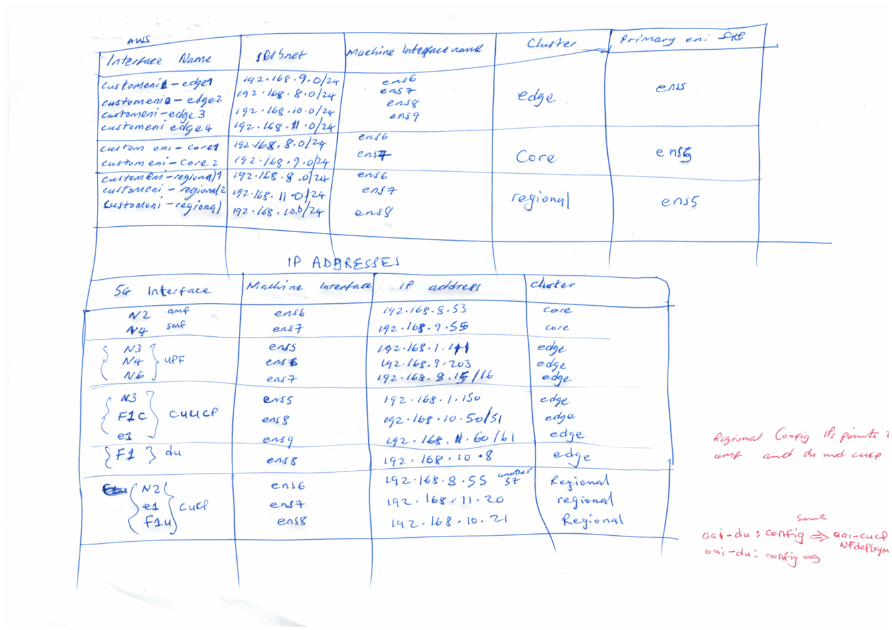

### **OAI 5G CONFIGURATION**

This section provides an overview of the IP address and network configuration used across worker nodes in workload clusters for OAI 5G deployment.
The auto approval for operators and network functions has been disabled to allow modification of the configurations before deployment.
--------------------------------------------------------------------------------------------------------------------------------------

#### Interface Requirements Per Cluster

Attach the following number of extra interfaces to **each worker node** in the respective workload clusters:

- **Edge Cluster** – 4 extra interfaces per worker node
- **Core Cluster** – 2 extra interfaces per worker node
- **Regional Cluster** – 3 extra interfaces per worker node
  

The interface assignments must match the expected Nephio 5G topology:


---

### GTP5G Kernel Module Installation

Install the `gtp5g` kernel module on all **worker nodes**:

```bash
sudo su
sudo apt update
sudo apt install gcc-12 g++-12
export CC=gcc-12

git clone https://github.com/free5gc/gtp5g.git
cd gtp5g
make
make install
```

### Interface Setup (DHCP Resolution)

Once interfaces are attached and **no IP addresses** are configured manually:

```bash
# Resolve IP via DHCP
sudo dhclient <interface-name>

# Optional: Kill DHCP client to prevent reassignment (if using L3 mode)
sudo pkill dhclient

# Clear assigned IPs (L3 only)
sudo ip addr del <ip-address>/24 dev <interface-name>
```

> **Note:** Killing the DHCP client (`pkill dhclient`) and removing IPs is **only necessary for Multus in L3 mode**. In L2 mode, skip this step.

### Connectivity Test

Ensure all worker nodes across clusters can ping each other before proceeding.

---

### Clone Required Repositories (do it on the Management Cluster)

```bash

git clone https://github.com/vitu1234/nephio-test-infra-aws test-infra
```

### Follow Official Guide

Refer to the [Nephio OAI Deployment Guide – Step 3 onward](https://github.com/nephio-project/docs/blob/R4/content/en/docs/guides/user-guides/usecase-user-guides/exercise-2-oai.md#step-3-deploy-dependencies-mysql-database-oai-core-and-ran-operator-in-the-workload-clusters)

#### Step 3: Deploy Dependencies, MySQL database, OAI Core and RAN Operator in the Workload clusters

Now you will need to deploy the MySQL database required by OAI UDR network function, OAI Core and RAN operators across the Workload clusters. To do this, you use *PackageVariant* and *PackageVariantSet*. Later uses an objectSelector to select the WorkloadCluster resources previously added to the Management cluster when you had deployed the *nephio-workload-cluster* packages (manually as well as via *PackageVariantSet*).

```bash
kubectl apply -f test-infra/e2e/tests/oai/002-database.yaml
kubectl apply -f test-infra/e2e/tests/oai/002-operators.yaml
```

The output is similar to:

```bash
packagevariantset.config.porch.kpt.dev/oai-common created
packagevariant.config.porch.kpt.dev/oai-cp-operators created
packagevariant.config.porch.kpt.dev/oai-up-operators created
packagevariant.config.porch.kpt.dev/oai-ran-operator-edge created
packagevariant.config.porch.kpt.dev/oai-ran-operator-regional created
```

#### Step 4: Check Database and Operator Deployment

Within five minutes of applying the RAN, Core Operator, and database Packages, you should see oai-core and oai-cn-operators namespaces on the Core workload cluster:

```bash
kubectl get ns --kubeconfig core.kubeconfig
```

The output is similar to:

```bash
kubectl get ns --kubeconfig core.kubeconfig
NAME                           STATUS   AGE
config-management-monitoring   Active   89m
config-management-system       Active   89m
default                        Active   90m
kube-node-lease                Active   90m
kube-public                    Active   90m
kube-system                    Active   90m
local-path-storage             Active   89m
metallb-system                 Active   89m
oai-cn-operators               Active   5m
oai-core                       Active   5m39s
resource-group-system          Active   88m
```

In the namespace oai-core you can check MySQL pod

```bash
kubectl get pods -n oai-core --kubeconfig core.kubeconfig
```

The output is similar to:

```bash
NAME                     READY   STATUS    RESTARTS   AGE
mysql-7dd4cc6945-lqwcv   1/1     Running   0          7m12s
```

In the oai-cn-operators namespace you should see control plane network function operators

```bash
kubectl get pods -n oai-cn-operators --kubeconfig core.kubeconfig
```

The output is similar to:

```bash
NAME                                 READY   STATUS    RESTARTS   AGE
oai-amf-operator-7cfcfdcf8f-m5b4h    1/1     Running   0          11m
oai-ausf-operator-746b56b745-zdfmc   1/1     Running   0          11m
oai-nrf-operator-57bc444f87-94x78    1/1     Running   0          11m
oai-smf-operator-5874557bb9-kbp4t    1/1     Running   0          11m
oai-udm-operator-6b4658b9c-nnnb7     1/1     Running   0          11m
oai-udr-operator-85464c47c9-wjprf    1/1     Running   0          11m
```

In regional and edge clusters you should see below namespaces,

```bash
kubectl get ns --kubeconfig regional.kubeconfig
```

The output is similar to:

```bash
NAME                           STATUS   AGE
config-management-monitoring   Active   98m
config-management-system       Active   98m
default                        Active   99m
kube-node-lease                Active   99m
kube-public                    Active   99m
kube-system                    Active   99m
local-path-storage             Active   98m
metallb-system                 Active   98m
oai-ran-operators              Active   14m
resource-group-system          Active   97m
```

```bash
kubectl get ns --kubeconfig edge.kubeconfig
```

The output is similar to:

```bash
NAME                           STATUS   AGE
config-management-monitoring   Active   98m
config-management-system       Active   98m
default                        Active   99m
kube-node-lease                Active   99m
kube-public                    Active   99m
kube-system                    Active   99m
local-path-storage             Active   98m
metallb-system                 Active   98m
oai-cn-operators               Active   14m
oai-ran-operators              Active   14m
resource-group-system          Active   97m
```

In edge cluster in oai-cn-operators namespace you will see only oai-upf network function.

```bash
kubectl get pods -n oai-cn-operators --kubeconfig edge.kubeconfig
```

The output is similar to:

```bash
NAME                                READY   STATUS    RESTARTS   AGE
oai-upf-operator-75cbc869cb-67lf9   1/1     Running   0          16m
```

#### Step 5: Deploy the Core Network Functions

You can start by deploying the core network functions which the operator will instantiate. For now, you will use individual *PackageVariants* targeting the Core and Edge cluster. In the future, you could put all of these resources into
yet-another-package - a "topology" package - and deploy them all as a unit. Or you can use a topology controller to create them. But for now, let's do each manually.

```bash
kubectl create -f test-infra/e2e/tests/oai/003-core-network.yaml
```

The output is similar to:

```bash
packagevariant.config.porch.kpt.dev/oai-nrf created
packagevariant.config.porch.kpt.dev/oai-udm created
packagevariant.config.porch.kpt.dev/oai-ausf created
packagevariant.config.porch.kpt.dev/oai-udr created
packagevariant.config.porch.kpt.dev/oai-amf created
packagevariant.config.porch.kpt.dev/oai-smf created
packagevariant.config.porch.kpt.dev/oai-upf-edge created
```

All the NFs will wait for NRF to come up and then they will register to NRF. SMF has a dependency on UPF which is
described by *dependency.yaml* file in SMF package. It will wait till the time UPF is deployed. It takes around
~800 seconds for the whole core network to come up. NRF is exposing its service via MetalLB external ip-address. In
case MetalLB ip-address pool is not properly defined in the previous section, then UPF will not be able to register to
NRF and in this case SMF and UPF will not be able to communicate.

### Check Core Network Deployment

You can check if all the control plane network functions are up and running

```bash
kubectl get pods -n oai-core --kubeconfig core.kubeconfig
```

The output is similar to:

```bash
NAME                        READY   STATUS    RESTARTS   AGE
amf-core-84b5cf67c7-7lzs5   1/1     Running   0          42m
ausf-core-7885cb865-pw525   1/1     Running   0          52m
mysql-7dd4cc6945-6pqmm      1/1     Running   0          75m
nrf-core-d4f69557d-5jb88    1/1     Running   0          52m
smf-core-68c4c76bbf-95v9z   1/1     Running   0          31m
udm-core-c7d67cb4d-wdvjx    1/1     Running   0          52m
udr-core-69c56bcbd5-sf8nc   1/1     Running   0          52m
```

The user plane network function UPF will be deployed on the Edge cluster

```bash
kubectl get pods -n oai-core --kubeconfig edge.kubeconfig
```

The output is similar to:

```bash
NAME                        READY   STATUS    RESTARTS   AGE
upf-edge-55ccb4f9d7-868k6   1/1     Running   0          30m
```

To verify that UPF and SMF are sharing PFCP heartbeats you can run the below commands

```bash
kubectl logs -n oai-core --kubeconfig edge.kubeconfig -l workload.nephio.org/oai=upf --tail=20
```

The output is similar to:

```bash
* Connection state changed (HTTP/2 confirmed)
* Copying HTTP/2 data in stream buffer to connection buffer after upgrade: len=0
* Using Stream ID: 1 (easy handle 0x622000382900)
> PATCH /nnrf-nfm/v1/nf-instances/59826e93-7365-4e6b-b94d-2c5636994825 HTTP/2
Host: 172.18.31.200
accept: */*
content-type: application/json
content-length: 58

* We are completely uploaded and fine
[2024-01-25 16:54:21.799] [upf_app] [info] Response from NRF, HTTP Code: 204
< HTTP/2 204 
< date: Thu, 25 Jan 2024 16:54:21 GMT
< content-type: application/json
< location: 192.168.1.21/nnrf-nfm/v1/nf-instances/59826e93-7365-4e6b-b94d-2c5636994825
< 
* Connection #0 to host 172.18.31.200 left intact
[2024-01-25 16:54:21.799] [upf_app] [info] Got successful response from NRF
[2024-01-25 16:54:21.817] [upf_n4 ] [info] handle_receive(16 bytes)
[2024-01-25 16:54:21.817] [upf_n4 ] [info] Received SX HEARTBEAT REQUEST
```

In the logs you should see **Received SX HEARTBEAT REQUEST** statement. If that is present then SMF and UPF are sharing PFCP heartbeats.

#### Step 6: Deploy RAN Network Functions

If the core network functions are running and configured properly then you can start by deploying RAN network function *PackageVariants*.

```bash
kubectl create -f test-infra/e2e/tests/oai/004-ran-network.yaml
```

The output is similar to:

```bash
packagevariant.config.porch.kpt.dev/oai-cucp created
packagevariant.config.porch.kpt.dev/oai-du created
packagevariant.config.porch.kpt.dev/oai-cuup created
```

Wait for ~1500 seconds for the RAN network functions to come up.

### Check RAN Deployment

You can check if the deployment of RAN components, CU-CP in Regional cluster and CU-UP and DU in Edge cluster respectively.

```bash
kubectl get pods -n oai-ran-cucp --kubeconfig regional.kubeconfig
```

The output is similar to:

```bash
NAME                             READY   STATUS    RESTARTS   AGE
oai-gnb-cu-cp-588f76c5f9-9fp54   1/1     Running   0          10m
```

```bash
kubectl get pods -n oai-ran-cuup --kubeconfig edge.kubeconfig
```

The output is similar to:

```bash
NAME                             READY   STATUS    RESTARTS   AGE
oai-gnb-cu-up-75475f949b-j6chc   1/1     Running   0          9m
```

```bash
kubectl get pods -n oai-ran-du --kubeconfig edge.kubeconfig
```

The output is similar to:

```bash
NAME                          READY   STATUS    RESTARTS   AGE
oai-gnb-du-6cb4cc5fcd-zvlrq   1/1     Running   0          9m
```

To check that RAN network functions are properly deployed it is important to check if N2, E1 and F1 links are created.

To verify E1 link between CU-CP and CU-UP is properly configured you can run the below commands

```bash
kubectl logs -n oai-ran-cucp --kubeconfig regional.kubeconfig -l app.kubernetes.io/name=oai-gnb-cu-cp --tail=-1 | grep "Accepting new CU-UP ID"
```

The output is similar to:

```bash
7792.449954 [NR_RRC] I Accepting new CU-UP ID 3584 name oai-cu-up (assoc_id 8)
```

To verify F1 link between CU-CP and DU is properly configured you can run the below commands

```bash
kubectl logs -n oai-ran-cucp --kubeconfig regional.kubeconfig -l app.kubernetes.io/name=oai-gnb-cu-cp --tail=-1 | grep "DU uses RRC version"
```

The output is similar to:

```bash
7424.185965 [RRC] I DU uses RRC version 17.3.0
```

To verify N2 link between AMF and CU-CP is properly configured you can run the below commands

```bash
kubectl logs -n oai-ran-cucp --kubeconfig regional.kubeconfig -l app.kubernetes.io/name=oai-gnb-cu-cp --tail=-1 | grep "Received NGAP_REGISTER_GNB_CNF: associated AMF"
```

The output is similar to:

```bash
9496.571150 [GNB_APP] I [gNB 0] Received NGAP_REGISTER_GNB_CNF: associated AMF 1
```

#### Step 7: Deploy UE

If all three links are configured then you can proceed with deploying the UE *PackageVariants*

```bash
kubectl create -f test-infra/e2e/tests/oai/005-ue.yaml
```

The output is similar to:

```bash
packagevariant.config.porch.kpt.dev/oai-ue created
```

The UE will be deployed in the Edge cluster in ~300 seconds. To verify that the UE is deployed you can use the below command

```bash
kubectl get pods -n oai-ue --kubeconfig edge.kubeconfig
```

The output is similar to:

```bash
NAME                         READY   STATUS    RESTARTS   AGE
oai-nr-ue-78846cf68c-rxkkz   1/1     Running   0          32m
```

To verify if the UE is successfully connected you can use the below command

```bash
UE_POD=$(kubectl get pods -n oai-ue --kubeconfig edge.kubeconfig  -l app.kubernetes.io/name=oai-nr-ue -o jsonpath='{.items[*].metadata.name}')
kubectl logs -n oai-ue $UE_POD -c nr-ue --kubeconfig edge.kubeconfig | grep "REGISTRATION ACCEPT"
kubectl logs -n oai-ue $UE_POD -c nr-ue --kubeconfig edge.kubeconfig | grep "Interface oaitun_ue1 successfully configured"
```

The output is similar to:

```bash
24908.869517 [NAS] I [UE] Received REGISTRATION ACCEPT message
24910.122107 [OIP] I Interface oaitun_ue1 successfully configured, ip address 10.2.0.2, mask 255.255.255.0 broadcast address 10.2.0.255
```

#### Step 8: Test the End to End Connectivity

To perform the end to end connectivity test you can ping from the UE to the UPF.

```bash
UE_POD=$(kubectl get pods -n oai-ue --kubeconfig edge.kubeconfig  -l app.kubernetes.io/name=oai-nr-ue -o jsonpath='{.items[*].metadata.name}')
UPF_POD=$(kubectl get pods -n oai-core --kubeconfig edge.kubeconfig -l workload.nephio.org/oai=upf -o jsonpath='{.items[*].metadata.name}')
UPF_tun0_IP_ADDR=$(kubectl exec -it $UPF_POD -n oai-core -c upf-edge --kubeconfig edge.kubeconfig -- ip -f inet addr show tun0 | sed -En -e 's/.*inet ([0-9.]+).*/\1/p')
kubectl exec -it $UE_POD -n oai-ue --kubeconfig edge.kubeconfig -- ping -I oaitun_ue1 -c 3 $UPF_tun0_IP_ADDR
```

The output is similar to:

```bash
PING 10.2.0.1 (10.2.0.1) from 10.2.0.2 oaitun_ue1: 56(84) bytes of data.
64 bytes from 10.2.0.1: icmp_seq=1 ttl=64 time=10.9 ms
64 bytes from 10.2.0.1: icmp_seq=2 ttl=64 time=12.1 ms
64 bytes from 10.2.0.1: icmp_seq=3 ttl=64 time=11.3 ms

--- 10.2.0.1 ping statistics ---
3 packets transmitted, 3 received, 0% packet loss, time 2002ms
rtt min/avg/max/mdev = 10.869/11.435/12.093/0.503 ms
```

For now the extra interfaces which are created using inter-connectivity script does not perform NAT to have internet access.

---

Ensure your interface configuration matches `oai-packages/oai-*/nad-*.yaml`.
Example configuration:


### Upstream Note on NRF and SMF Dependency

> *All Network Functions (NFs) wait for NRF to start and register. SMF depends on UPF (via `dependency.yaml`). The full core may take ~800s to deploy. Make sure MetalLB IP pools are correctly defined; otherwise, NRF won't register and SMF ↔ UPF communication fails.*

### Configuring LoadBalancer Services

For `oai-nrf-operator` and `oai-udr-operator` deployments:

- Set the environment variable `SVC_TYPE=LoadBalancer`
- Assign a static LoadBalancer IP

In `oai-upf-op-conf` (ConfigMap in oai-up-operators edge repo), set the `fqdn.nrf` to match:

```yaml
fqdn:
  nrf: '192.168.28.148'  # Replace with actual LoadBalancer IP of NRF service
```

- **LBA IN AWS FOR THE CORE CLUSTER**

  ```bash
  apiVersion: metallb.io/v1beta1
  kind: IPAddressPool
  metadata:
    name: ip-pool
    namespace: metallb-system
  spec:
    addresses:
    - 172.31.0.241/32 #ip address of node on whichever the NRF is running on
  ---
  apiVersion: metallb.io/v1beta1
  kind: L2Advertisement
  metadata:
    name: l2
    namespace: metallb-system
  ```

### Bonus: Edit Packages Without UI

```bash
# Clone a package revision
porchctl rpkg copy -n default <pkg-revision> --workspace=v2

# Pull package to local directory
porchctl rpkg pull <pkg-revision> -n default oai-amf

# Push updated package
porchctl rpkg push <pkg-revision> -n default oai-amf

# Propose and approve changes
porchctl rpkg propose <pkg-revision> -n default
porchctl rpkg approve <pkg-revision> -n default
```
