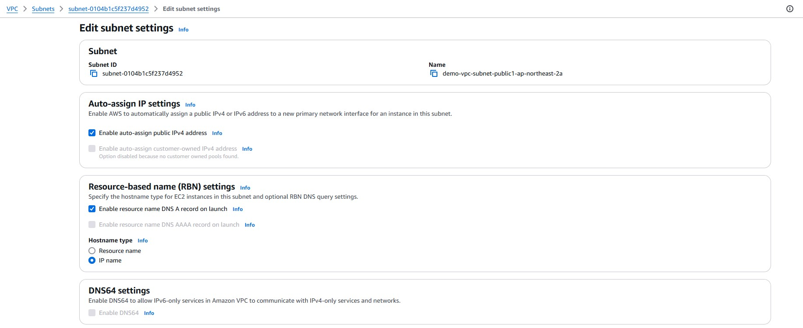
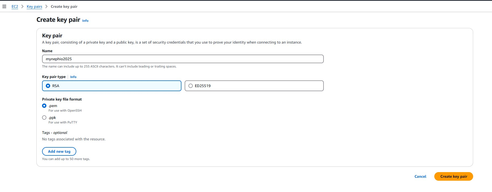

### **STEP BY STEP PICTURE VIEW GUIDE**

#### Step 1

- Create and Configure AWS Resources

  
- After creating you should have something like this

  

  
- Edit subnet settings to allow auto-assign public ipv4 address to instances

  
- create you key-pair in EC2 menu

  

#### Step 2

- Configure Ansible Playbooks with Values from the created AWS resources

  - Variables to create management cluster Instances:

  
- - Auth Variables for Ansible to create AWS EC2 Instances:

  

  - Auth Variables for cloud formation and Cluster API:

    
- Auth Variables expire after 12hours, can be updated later!

#### Step 3

- Run the Ansible Playbook program from the local computer

  
- Takes 10-15mins bootstrapping the management cluster.
- Will create 1 Control node and 2 worker nodes

  

#### Step 4

- Accessing the Management Cluster Via SSH

  - Management cluster nodes

  
- SSH into the control node to access nephio components and create workload clusters

#### Step 5

- Check all the pods and repositories running in the management cluster

  
- Stock  and management repositories

  

#### Step 6

- Accessing the Management Cluster Via webui

  

  

#### Step 7

- Accessing the Nephio Via webui

1. Shows all registered repository, containing Infra resources for deployment
2. Contains core packages for respective clusters in deployment
3. All registered repositories from upstream provider

  

#### Step 8

- Creating workload clusters (core, regional and edge)

1. Clone the git repo with packagevariants already created to create 3 clusters with one command and apply resources

  

1. 3 drafts revisions for each cluster created

  

1. If multi-cluster connectivity is a priority, delete the flannel PackageVariant from each clusters’ revision

  

#### Step 9

- Creating workload clusters (core, regional and edge)

  

  

  Some infra and core packages in drafts in both mgmt and mgmt-staging respectively requires manual editing to add AWS variables and add git server URL and port

  

#### Step 10

- After 2-5mins we have the instances created, up and running and each cluster will have its own git repo.

  
- Next, we have to get kubeconfig and install Cilium CNI otherwise if cluster interconnectivity is not required, no need to install a CNI as it will automatically be configured with Nephio through ArgoCD

  

  

#### Step 11

- Installing cilium CNI on the workload clusters (core, regional and edge)

  
- install Cilium CNI otherwise if cluster interconnectivity is not required, no need to install a CNI as it will automatically be configured with Nephio through ArgoCD

  
- After installing Cilium, we have to interconnect the clusters using the ciliumctl

#### Step 12

- Installing cilium CNI on the workload clusters (core, regional and edge)
- Edge and core clusters interconnected:

  
- install Cilium CNI otherwise if cluster interconnectivity is not required, no need to install a CNI as it will automatically be configured with Nephio through ArgoCD
- After installing Cilium, we have to interconnect the clusters using the ciliumctl

#### Step 13

- Installing cilium CNI on the workload clusters (core, regional and edge)

  

  Regional, Edge and core clusters interconnected and passed the cilium interconnectivity test:

  
- install Cilium CNI otherwise if cluster interconnectivity is not required, no need to install a CNI as it will automatically be configured with Nephio through ArgoCD
- After installing Cilium, we have to interconnect the clusters using the ciliumctl

#### Step 14

- Iperf Test – testing pod-pod communication between clusters
- Iperf test conducted between edge and core cluster run successfully

  
